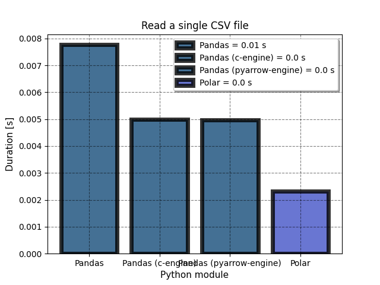

# Polars v Pandas

## Quick dataframe performance comparison between Polars and Pandas, with and without PyArrow backend

  :warning: **WARNING**
  Not an exhaustive performance benchmarks, only reflects performance on Apple MacBook Pro M1

## License

This project is licensed under the terms of the MIT license.
